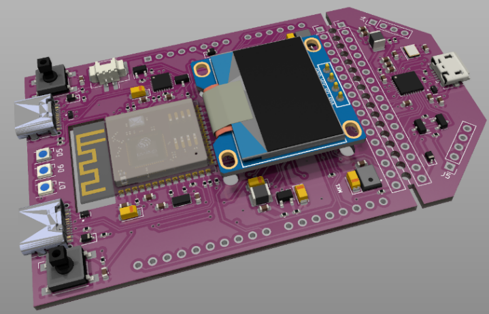
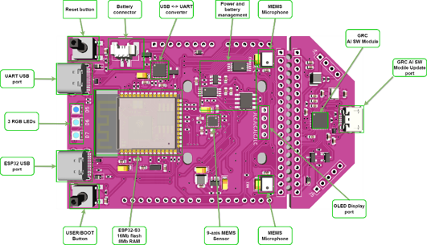

# Development Kit and Reference Design for Industrial AIoT Applications GRC Dev Board
## Description
The GRC  Dev Board is a development kit and reference design that simplifies prototyping and testing of advanced industrial AIoT applications such as Anomaly Detection and n-Class Classification for predictive maintenance.

High performance speed is achieved due the use of reservoir computing methods implemented in the GRC AI Module.

The GRC Dev Board allows

* Promptly testing ready-made, pre-configured neural network;
* Checking viability of ML-algorithms in solving your particular tasks;
* Selecting AI functionality which will suit best to your goals;
* Developing SW, debugging and testing for your target device.

The GRC Dev Board provides functionality for simple sensors connection, on-the-fly software development and debugging, i.e.
* Sensors management and control
* Data pre-processing
* Data formatting for their further processing in the GRC AI Module
* Data flow transfer onto the GRC AI Module
* GRC AI Module management and control
* GRC AI Module results output
* Data post-processing
* Results shown on OLED display and/or via LEDs

## Functional Scheme

## Interaction with GRC AI Module

The GRC Dev Board serves best for developing PoC, MVP, and prototypes. It communicates with GRC AI Module via API interfaces.

The work of the neural network created for the AI tasks is run on the MCU using input data gathered from sensors. The solution provides:​

* **“Training”** mode:​
  * With an operator;​
  * Autonomously;​
  * Performance speed **less than 2 seconds**;​
  * No dataset and data mapping is required.​
* **“Classification”** mode:​
  * Up to 10 categories including anomaly;​
  * Performance speed **less than 2 seconds**.​

## GRC Dev Board Concept Design

## GRC Dev Board Description

## Features:

* GRC Dev Board is a multi-sensing module for implementing AI-driven solutions by adding Anomaly Detection and n-Class Classification functionality
* Built around ESP32 core system board possessing all appealing expansion, processing, computing and performance characteristics of the original MCU and even more
* Processors:
	* Main processor: Tensilica Xtensa 32-bit LX7 microprocessor 
		* Cores: 2 
		* Clock frequency: up to 240 MHz
		* Performance: up to 600 DMIPS
* Easily-detachable GRC AI SW module, a tailored solution for AIoT tasks
* Memory
	* 384 KB ROM
	* 512 KB SRAM
	* 16 KB SRAM in RTC
	* 16 MB of PSRAM
	* 16 MB of SPI Flash
* Connectivity: USB, UART to USB interface CP2102N
* Rich choice of sensors:
	* 2 ultra-compact, low-power, omnidirectional, digital MEMS microphone MP34DT06JTR (PDM microphones)
	* A multi-chip module MPU-9250 (9-axis sensor: a gyroscope, an accelerometer, and a compass)
* Modular architecture, expandable via on-board connectors:
	* ESP32 USB port
	* UART USB port
	* Battery connector
	* OLED Display port
	* Arduino compatible extension port
* Support of battery power supply with charge control and protection
* Other Dev Board components:
	* 3 RGB LEDs – SK6805
	* 2 buttons: Reset and User/Boot
	* Power and battery management
	* OLED Display (optional)
## COMPONENTS LIST
* ESP32-S3-WROOM
* GRC AI Module
* Digital MEMS microphone MP34DT06JTR
* MPU-9250

## Recommended sensors
* Vibrations sensors
* Microphones
* Current sensors
* Accelerometers
* Temperature sensors
* Other sensors used in your apps which control time series data flow

## Demo scenarios:​
* Recognition of hand wave gestures​
* Rhythm recognition
* Predictive maintenance​
* Learning command words

## Scheme of Warm-Up Mode

## Benefits:
* Quick step into prototyping AI-enhanced solutions
* Cutting-edge technologies at hand
* High speed performance provides new level of prototyping and testing to keep up with the newest tendencies

## Application Domain:
* Condition monitoring
* Predictive maintenance
* Control Systems
* Smart Home Systems
* Security Systems

## Technical Specification:
Please refer to Developer's Guide for detailed technical characteristics.

## Perks of using GRC Dev Board:
* Saving time and resources at the development stage, as there is no need in
	* Development of mathematical and statistical anomaly models
	* Signal mapping and dataset preparation;
	* Training model in the cloud
* Reducing expenses for the end solution, as there is no need to spend money on
	* Data transfer from a target device
	* Storing large amounts of data
	* Support of infrastructure for processing large data amounts
* Development of autonomous solutions due to low power consumption * and no need in data transfer to a server.
* Privacy and security are guaranteed as there is no need in transferring sensor signal from the target device to a server
* Vast potential of developing flexible solutions configurable to particular hardware.
* Ultra-low latency: Real-time applications

## Delivery Documents: ​
* Quick Start;​
* User Manual;​
* Developer’s Guide;​
* Code examples;​
* Recommendation on embedding AI Module into devices and equipment

## CONTACT US:
grc@grovety.com

https://grovety.com 

