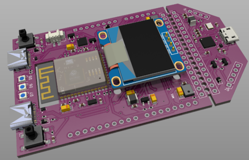
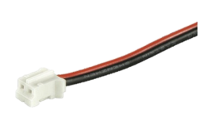
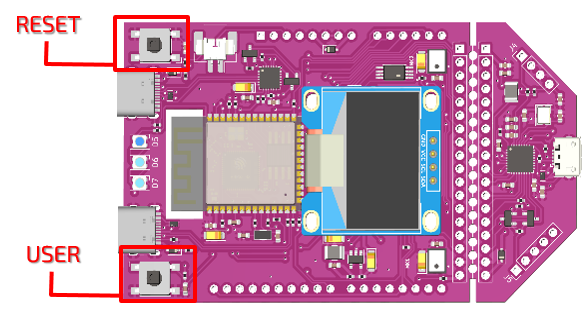
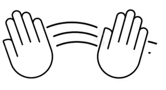

# GRC ESP 32 Dev Board Quick Start
 
## In the Box

### GRC Dev Board

### 2 PIN Battery connector with cables

### USB-C 2m Cable

Note: an OLED display is an optional component, therefore, it will not be delivered unless specifically requested.

## Connect Power Supply

OR

## What is inside?

The Dev Board has pre-installed applications to demonstrate its abilities to the utmost:
* Gesture – reading, learning and recognizing hand gestures;
* Rhythm – learning and recognizing rhythm patterns;
* Vibro – detecting anomalies in fan work.

The **Warm-Up** mode allows to easily get acquainted with the Dev Board and to start working with it at once.

## Buttons 

* **RESET** for re-starting
* **USER** for control commands

The USER button has three possible uses:
* **Press**: to switch between menu items
* **Press and hold**: to select the menu item displayed on the screen
* **Press, hold and release**: when learning or reading a gesture

## Voice commands

Manage the Dev Board by giving voice commands.

**Example A**: say "**1**" to select and enter the first menu item displayed on a screen.

**Example B**: say "**GO**" to start the gesture learning process and "**STOP**" to finish it.

The list of the command words is given in Appendix A.

## Warm-Up

Enter the Warm-Up mode.

Step 1. Learn to repeat pre-trained hand gestures.
* Select operation “Read: Hi” and show the **Hi** gesture. 
* If the gesture is correct, then the name of the gesture will be in voice and screen messages.
* Try again with the *OK* gesture

GOOD JOB! Let’s make it more challenging.

Step 2. Learn training and classification of simple hand gestures.

* Select operation “Train: Come here”.
* Start the training process and show the *Come here* gesture.
* Show it again to see if it is properly trained.
* If the gesture is correct, then the name of the gesture will be in voice and screen messages.
* Try again with the *Number 8* gesture

Step 3. Training and classification of any short rhythms.
* Select operation “Train: rhythm”.
* Start the training process.
* Do it again.
* If the gesture is correct, OK will be in voice and screen messages.
 
GREAT! You are ready for the Main mode!

## Appendix A

| Command Word​ | Used for​ |
| --- | --- |
| GO​ |	Starting a procedure (learning, reading)​ |
| STOP |​ Stopping a procedure (learning, reading)​ |
| YES​ | Confirming action (for saving, deleting, overwriting)​ |
| NO​ | Cancelling action (for saving, deleting, overwriting)​ |
| 1/2/3/4/5 | Selecting the Nth element on the list or menu​ |se
